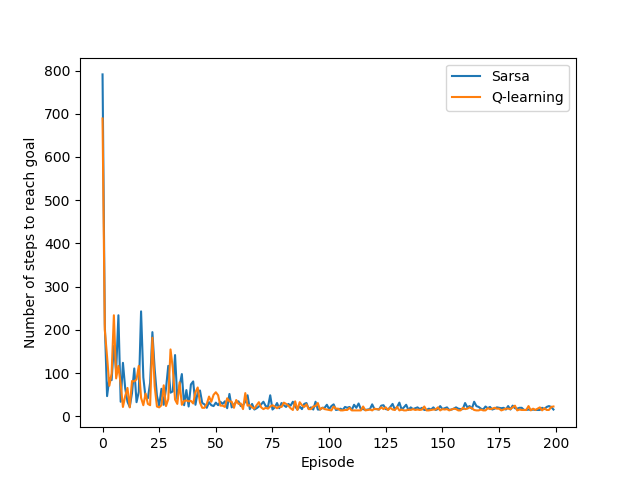

# Temporal Difference Learning

This is a python implementation of Sarsa and Q-learning applied to a windy gridworld problem. For more information check out my blog article about temporal difference learning https://cfml.se/blog/temporal_difference_learning/.
